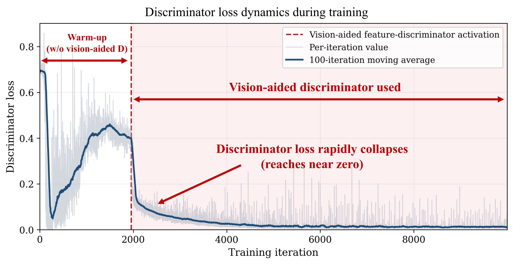
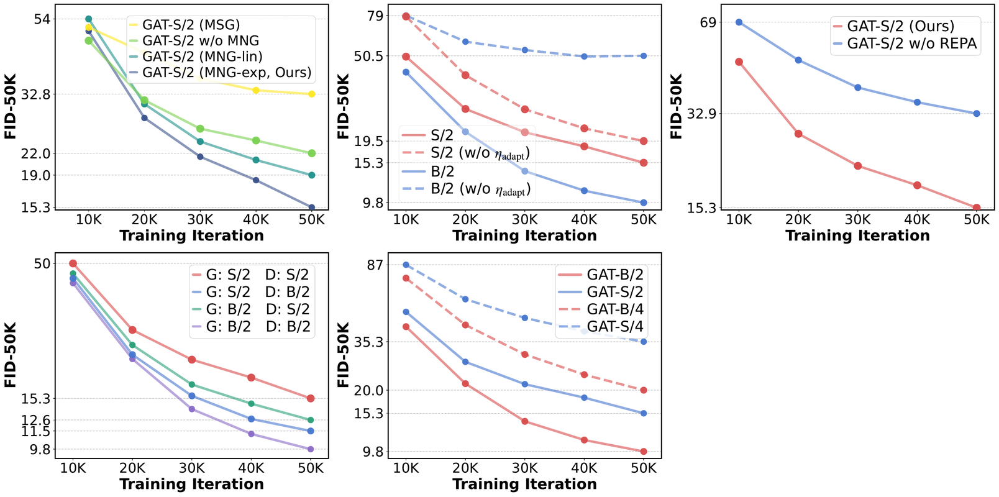
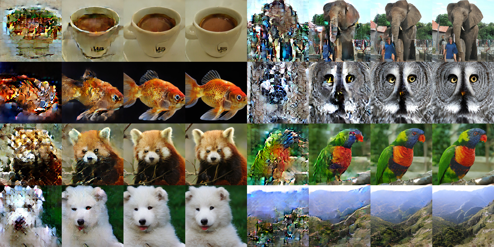
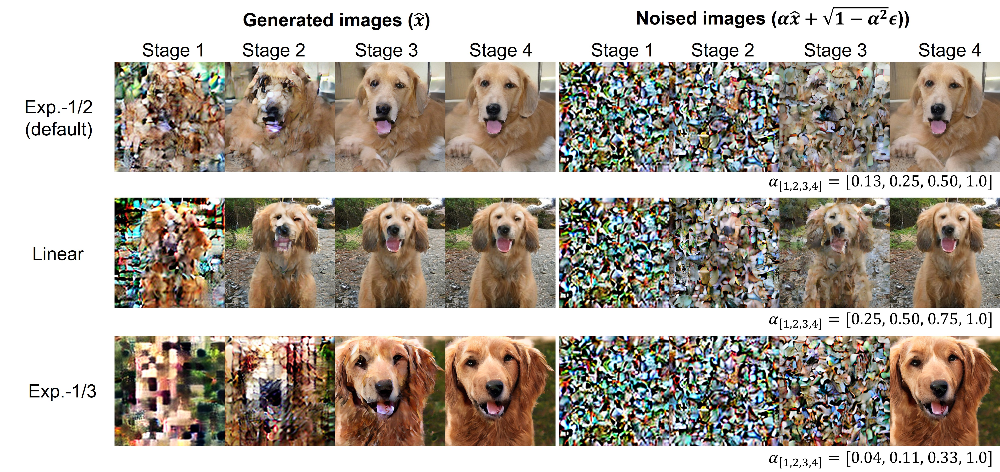
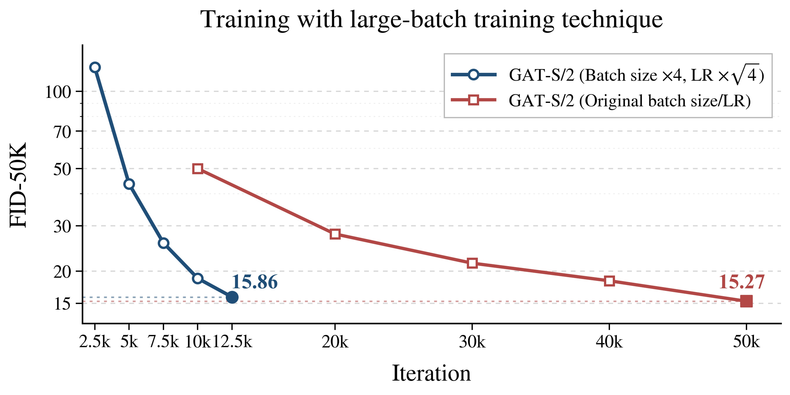

# ICML 2026 submission 31818 rebuttal figures

## Figure R1

**Figure R1. Training instability with Projected GAN-style auxiliary discriminator.** Training curves of GAT-XL/2 with and without a Vision-aided GAN-style auxiliary discriminator. The auxiliary discriminator, which applies frozen pretrained features to the final decoded pixel-space output, leads to rapid discriminator loss collapse and severe mode collapse, indicating the needs for careful tuning of discriminator to maintain training stability. Our REPA-style alignment achieves stable training without this instability. Note that, vision-aided discriminator is attached after warmup of 1M images, following the original implementaion.

---

## Figure R2

**Figure R2. Ablation study about FID-50K training curves.** 
FID-50K versions of the ablation results reported in Figure 3-b, Figure 5, and Figure 6-a of the main paper. From left-top to right-bottom, figures reports the ablations about a) MNG, b) adaptibe LR, c) REPA, d) decoupled scaling of G and D, and e) patch size. 

---

## Figure R3

**Figure R3. Examples of the generated results from every stage (GAT-XL/2).** 
Intermediate outputs from each generator stage (GAT-XL/2). Each row shows the outputs from stage 1 (leftmost) through stage K (rightmost) for a given class. Earlier stages capture global structure such as layout and dominant color under strong noise perturbation, while later stages progressively refine local details and texture, demonstrating the intended coarse-to-fine synthesis behavior of MNG.

---

## Figure R4

 
**Figure R4. Comparison of noise schedules and their effect on generated images (GAT-S/2).** 
Each row corresponds to a different scheduling scheme; exp-1/2 (our default, α = 0.125, 0.25, 0.5, 1.0), linear (α = 0.25, 0.5, 0.75, 1.0), and exp-1/3 (α ≈ 0.037, 0.111, 0.333, 1.0). For each row, the left panel shows the raw intermediate outputs at each stage, and the right panel shows the same outputs after applying the corresponding noise perturbation, illustrating what the discriminator actually observes during training. The exp-1/2 schedule achieves the best FID-50K (15.27 vs. 17.66 for exp-1/3 and 18.96 for linear), retaining sufficient clean signal in early stages for meaningful structural supervision while preserving clear stage-wise differentiation.

---

## Figure R5

 
**Figure R5. Training with large-batch training technique (GAT-S/2).** With the square root scaling rule between batch size and learning rate known for capatible with adam optimizer, the large-batch run reaches comparable FID in approximately 1/4 of the iterations, demonstrating that our width-aware LR transfer rule composes naturally with standard batch-size scaling.

---

## Table R1

|              | GAT-XL (60 epo) | GAT-XL (40 epo) | StyleGAN-XL | MeanFlow-XL |
|:-------------|:----------------:|:----------------:|:-----------:|:-----------:|
| CLIP-FID ↓   | **1.860**        | 2.209            | 2.616       | 3.169       |
| IS ↑         | 245.45           | 241.98           | **265.12**  | 260.69      |
| FID ↓        | **2.18**         | 2.96             | 2.30        | 3.41        |
| sFID ↓       | 5.27             | 5.11             | **4.02**    | 5.36        |
| Precision ↑  | 0.796            | 0.805            | 0.780       | **0.810**   |
| Recall ↑     | **0.572**        | 0.527            | 0.530       | 0.525       |

**Table R1. Comparison with one-step generators on ImageNet 256.**
 GAT-XL achieves the strongest CLIP-FID by a substantial margin, already surpassing all baselines at 40 epochs and improving further at 60 epochs, indicating superior distributional quality under an evaluation metric independent of ImageNet-classification-trained features. We additionally report Inception-based metrics (FID, sFID, IS, precision, recall) for completeness; note that StyleGAN-XL employs ImageNet-pretrained classifiers as discriminator backbones, which share representational overlap with these Inception-based evaluations.

---

## Table R2

 | Config | Total Params | Total GFLOPs | FID-50K↓ |
|:---|---:|---:|---:|
| G-S / D-B | 143.97M | 58.22 | 11.45 |
| G-B / D-S | 146.12M | 54.48 | 12.62 |
| G-M / D-M | 132.43M | 52.69 | 11.47 |

**Table R2.** Scaling strategy comparison under matched compute budget. G-S/D-B and G-B/D-S use asymmetric generator–discriminator configurations; G-M/D-M uses a symmetric intermediate model (C=576, 9 heads). Total parameters and GFLOPs are within ~10% across all three configurations. FID-50K is measured at 50K training iterations on ImageNet 256².
